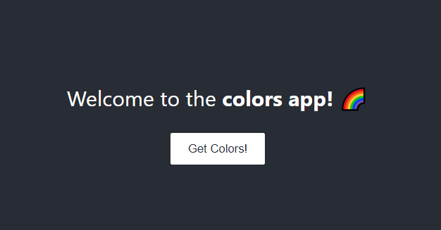

# NodeJS CORS in action

## Repository Overview
This repository was set up to follow a tutorial on NodeJS CORS (Cross-origin resource sharing). The tutorial I followed can be found at: https://www.stackhawk.com/blog/nodejs-cors-guide-what-it-is-and-how-to-enable-it/

Creating a simple colors app

## Notes on what I learned
* Using a fetch request from the frontend (http://localhost:3000) to backend (http://localhost:5000) can result in a CORS error because they are both on different domains/origins. By default, cross-origin resource sharing is disabled. Because every HTTP request sends a request header about the request origin, the backend "knows" that the request is from a different origin.

* There are 3 ways to enable CORS on a server:
    1. Allow all origins to access the resource by using the 'wild card' property ('*') in the response header e.g. `res.set("Access-Control-Allow-Origin", "*")`
    2. Allow one certain origin to access the resource by specifying the allowed origin in the response header e.g. `res.set('Access-Control-Allow-Origin', 'http://localhost:3000');`
    3. Allow all or certain origins to access the resource using the `cors middleware` e.g.

      const cors=require('cors');
      app.use(cors())

      or

      const options = {
        origin: [
          'http://localhost:3000',
          'http://localhost:8080'
        ]
      }
      app.use(cors(options))

      or

      app.get('/colors',cors(),(req,res)=>{
        res.json(colors)
      })

* **Git related:** On my first commit, I noticed that the "client" file pushed to GitHub had an arrow in it and the folder was not clickable.
  * 
  * This was due to another .git folder in the client folder. The .git folder was created by default when I created the React app via `npx create-react-app client`.
  * To solve this, I deleted the .git folder and .gitignore file in the "client" folder. Then, I had to run `git rm --cached client`. I pushed to GitHub again and the arrow disappeared from the "client" folder. I was able to click into the folder on GitHub.
  * 

* Axios vs fetch(): `axios` automatically converts requested data to JSON, while `fetch()` requires the use of `response.json()` (Source: https://blog.logrocket.com/axios-vs-fetch-best-http-requests/)

* A **proxy server** is a 'gateway' server that has CORS enabled and has access to server resources. The frontend/client sends requests to the proxy server, which in turn gets the server resources. The proxy server will send back the resources to the client.
  * E.g. In this tutorial, the frontend/client (App.js) tried to request a "CORS disabled" server (`http://localhost:8080/user`) (index.js). This resulted in a CORS error. However, the client was instead re-routed to the proxy server using `http://localhost:5000/user` (app.js). The proxy server had CORS enabled with `app.use(cors())` and was able to access the "CORS disabled" server using a GET request with `axios.get('http://localhost:8080/user')` (app.js).
